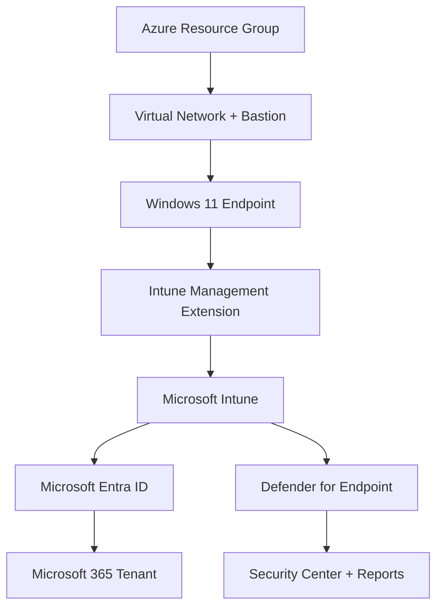

# 💻 Intune Administration Lab

## 🧱 Overview
The **Intune Administration Lab** demonstrates the complete lifecycle of Windows 11 endpoint management within a Microsoft 365 E5 tenant.  
This project integrates **Azure infrastructure**, **Microsoft Intune**, **Entra ID**, and **Defender for Endpoint** to simulate real-world device administration, compliance, and security remediation workflows.

Through four structured phases, the lab highlights enterprise-ready skills in modern management, automation, and security configuration—building upon Azure fundamentals and Microsoft 365 governance principles.

---

## ⚡ Quick Start

### 🧩 Prerequisites
Ensure the following before you begin:

- **Microsoft 365 E5 Developer Tenant** (Global Admin permissions)  
- **Active Azure Subscription** (Free or Pay-As-You-Go)  
- **Azure Bastion and Virtual Network quota** available  
- **Windows 11 ISO or VM image** for device enrollment testing  
- **PowerShell 7+** installed locally  

> 🗝️ **Optional:** Join the [Microsoft 365 Developer Program](https://developer.microsoft.com/microsoft-365/dev-program) for a renewable E5 tenant including Intune and Entra ID.

---

### 🧰 Environment Setup Steps

#### **Step 1 – Azure Resource Creation**

Create a Resource Group, Virtual Network, and Bastion Host for secure access.

```powershell
# Login and create resource group
Connect-AzAccount
New-AzResourceGroup -Name "Intune-Lab" -Location "WestUS2"

# Create virtual network and subnet
New-AzVirtualNetwork -Name "IntuneLab-VNet" -ResourceGroupName "Intune-Lab" -Location "WestUS2" -AddressPrefix "10.0.0.0/16"

# Add Bastion subnet
Add-AzVirtualNetworkSubnetConfig -Name "AzureBastionSubnet" -AddressPrefix "10.0.1.0/27" -VirtualNetwork (Get-AzVirtualNetwork -Name "IntuneLab-VNet" -ResourceGroupName "Intune-Lab")

# Deploy Azure Bastion
New-AzBastion -Name "IntuneBastion" -ResourceGroupName "Intune-Lab" -PublicIpAddressName "IntuneBastionIP" -VirtualNetworkName "IntuneLab-VNet" -Location "WestUS2"
```

---

#### **Step 2 – Virtual Machine Deployment**

Deploy a Windows 11 test VM that will be managed through Intune.

```powershell
New-AzVM `
  -ResourceGroupName "Intune-Lab" `
  -Name "IntuneClient01" `
  -Image "MicrosoftWindowsDesktop:windows-11:win11-23h2-pro:latest" `
  -Size "Standard_B2s" `
  -AdminUsername "IntuneAdmin" `
  -AdminPassword (ConvertTo-SecureString "YourStrongPassword123!" -AsPlainText -Force)
```

---

#### **Step 3 – Intune Enrollment**

1. Open **Settings → Accounts → Access work or school** on the VM.  
2. Click **Connect**, then sign in with your Microsoft 365 E5 credentials.  
3. Confirm the device appears in **Intune → Devices → All Devices**.

> 💡 Verify MDM enrollment with PowerShell:
>
> ```powershell
> dsregcmd /status
> ```

---

#### **Step 4 – Policy and Application Deployment**

Use **Intune → Configuration Profiles** to:

- Deploy **BitLocker encryption**  
- Push **Microsoft 365 Apps for Enterprise**  
- Apply **Security Baselines**

---

#### **Step 5 – Defender Integration**

Enable **Microsoft Defender for Endpoint** within Intune and validate device reporting in the **Microsoft 365 Security Center**.

```powershell
Get-MpComputerStatus | Select AMServiceEnabled, AntivirusEnabled, RealTimeProtectionEnabled
```

---

## 🎯 Objectives

- Configure Azure resources for secure remote endpoint management  
- Enroll and manage Windows 11 devices via Intune  
- Deploy compliance and configuration policies  
- Integrate Defender for Endpoint for security monitoring  
- Automate auditing and remediation with PowerShell and Graph API  

---

## 🧩 Lab Architecture



*Architecture of the Intune Administration environment showing cloud identity, endpoint, and security integration.*

---

## 🧠 Technologies & Tools

| Category | Tools / Services Used |
|-----------|-----------------------|
| **Identity** | Microsoft Entra ID |
| **Device Management** | Microsoft Intune |
| **Endpoint Security** | Microsoft Defender for Endpoint |
| **Automation** | PowerShell, Microsoft Graph API |
| **Monitoring** | Microsoft 365 Security Center, Endpoint Reports |
| **Infrastructure** | Azure Virtual Machines, Azure Bastion |

---

## 🧪 Phase Summaries

| Phase | Title | Description | Key Outcomes |
|--------|--------|--------------|---------------|
| [Phase 1](./Phase%201%20–%20Azure%20Infrastructure%20Setup/README.md) | **Azure Infrastructure Setup** | Provisioned Azure resources to establish a secure remote environment for Intune management. | Resource Group, VNet, Bastion, Server setup |
| [Phase 2](./Phase%202%20–%20Intune%20Enrollment%20&%20Device%20Management/README.md) | **Intune Enrollment & Device Management** | Registered Windows 11 client and validated MDM enrollment. | Compliance policy, enrollment dashboard |
| [Phase 3](./Phase%203%20–%20Application%20Deployment%20&%20Configuration%20Profiles/README.md) | **Application Deployment & Configuration Profiles** | Deployed M365 apps and BitLocker encryption policy through Intune. | Configuration profiles, BitLocker policy |
| [Phase 4](./Phase%204%20–%20Monitoring,%20Reporting%20&%20Endpoint%20Security%20Remediation/README.md) | **Monitoring & Endpoint Security Remediation** | Integrated Defender for Endpoint and analyzed device health reports. | Defender integration, PowerShell reporting |

---

## 🏢 Business Relevance

This Intune Administration Lab mirrors the core responsibilities of a modern **Microsoft 365 Endpoint Administrator** and demonstrates how technical implementation directly supports business outcomes.

| Business Objective | Technical Alignment | Impact |
|--------------------|--------------------|--------|
| **Secure Hybrid Work Environment** | Implemented Azure Bastion and Intune MDM to enable secure remote device access and management. | Reduced remote access risks and ensured consistent endpoint governance. |
| **Regulatory & Compliance Readiness** | Applied configuration baselines and BitLocker encryption policies through Intune. | Strengthened data protection and compliance posture across enrolled devices. |
| **Operational Efficiency** | Automated device onboarding, reporting, and compliance verification via PowerShell scripting. | Reduced manual workload for IT admins and improved MTTD/MTTR for device issues. |
| **Unified Endpoint Management (UEM)** | Centralized device, app, and security management in Microsoft Intune. | Lowered administrative overhead and enhanced visibility across the organization. |
| **Threat Detection & Response** | Integrated Microsoft Defender for Endpoint telemetry with Intune monitoring. | Enabled proactive remediation and better incident response coordination. |

By demonstrating technical and business alignment, this lab validates the ability to:
- Design, deploy, and manage secure endpoint solutions in cloud environments.  
- Translate governance requirements into actionable Intune and Entra ID configurations.  
- Support enterprise IT teams in maintaining compliance, security, and operational reliability.

---

## 📸 Highlight Screenshots

  
*Windows 11 device successfully enrolled into Intune.*

  
*Deployment of BitLocker encryption policy through Intune.*

  
*Defender for Endpoint policy enforcing antivirus and threat remediation.*

---

## 🏁 Acknowledgments

Special thanks to **Microsoft Learn**, **Intune documentation**, and the **Microsoft community** for guidance on Intune configuration and hybrid identity management.  

A sincere thank-you to **ChatGPT (OpenAI)** for technical insight, documentation support, and structural guidance throughout this project.

---

